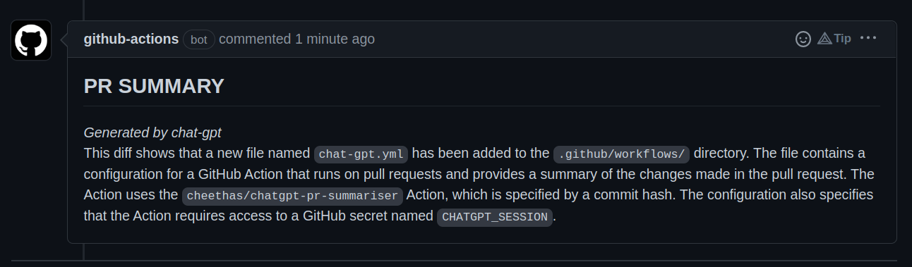

# chatgpt-pr-summarizer

> This repo is experimental and may not provide accurate descriptions.

A github action that gets chatGPT to summarize all of of the changes in a pr.

## Installation

```yaml
name: PR-Summary

on: [pull_request]

jobs:
  summary:
    name: "PR Summary"
    runs-on: "ubuntu-latest"
    # You can manually set these permissions in your GITHUB tokens, see here:
    # https://docs.github.com/en/actions/security-guides/automatic-token-authentication#modifying-the-permissions-for-the-github_token
    permissions:
      contents: read # required to view diff
      id-token: write
      issues: write # required to write comment
      pull-requests: write # required to write comment

    steps:
      - uses: actions/checkout@v3 # Checkout must be performed first
      - name: "Summarize"
        uses: cheethas/chatgpt-pr-summarizer@v1
        with:
          chatgpt-session-token: ${{ secrets.GHATGPT_SESSION }}
```

## Example

The following is an example of a summary provided by the action when adding the action file itself!


## Session Tokens

This package requires a valid session token from ChatGPT, under the hood it is using an unofficial REST API. Normal
authentication options are not available.

To get a session token:

1. Go to https://chat.openai.com/chat
2. Open dev tools (right click > inspect || Ctrl-shift-i || F12)
3. Open Application > Cookies
4. Copy the value of \_\_Secure-next-auth.session-token

Provide this value for `chatgpt-session-token` in the action's inputs.

## Acknowledgements

Alot of code for getting the diff is taken directly from and using libraries developed by
[Technote-Space](https://github.com/technote-space)

- [Git-Diff Action](https://github.com/technote-space/get-diff-action)
- [Commit Comment Action](https://github.com/peter-evans/commit-comment)
